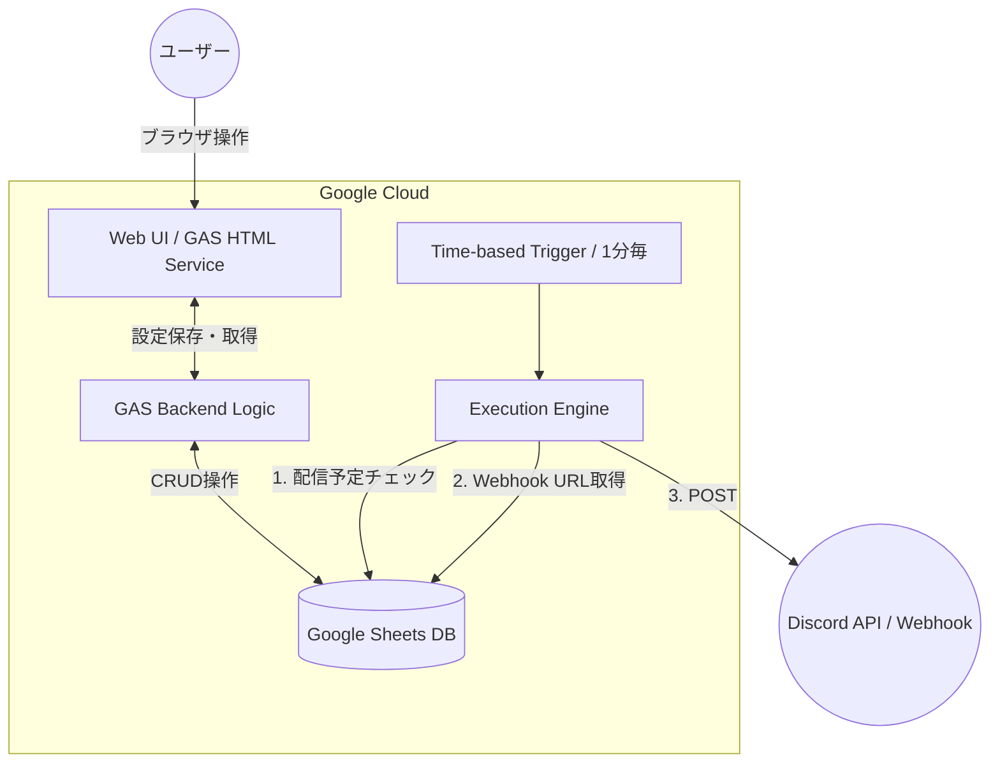

サーバーレスのDiscordリマインダーシステムです。
ブラウザUIからスケジュール管理を行い、Google Apps Script (GAS) を通じてDiscord Webhookへ通知を飛ばします。

データストアとしてGoogleスプレッドシートを利用します。
ユーザーが設定したリマインダー内容とステータス、キューとしての機能を持ちます。

スプレッドシートは直接操作せず、GAS Web Appを利用した入力フォームを用意しています。
リマインダーの入力、バリデーションチェック、テンプレート管理、一覧表示、編集削除機能を提供します。

Web AppからのリクエストをGAS Backendが受け取り、スプレッドシートへ反映します。
リマインダー対象を1分ごとにチェックし、Discord Webhookでリマインドを送信します。

